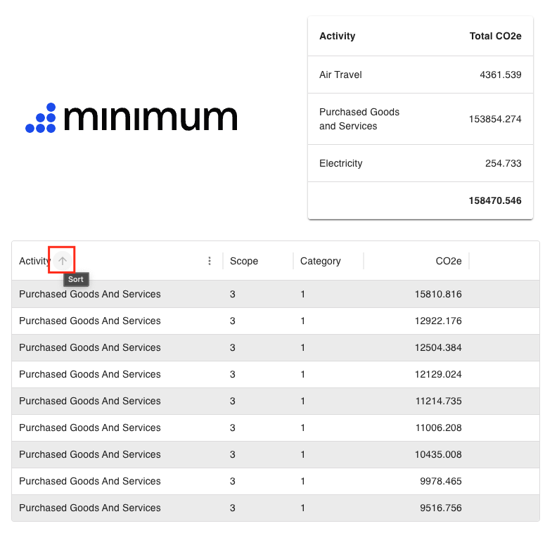
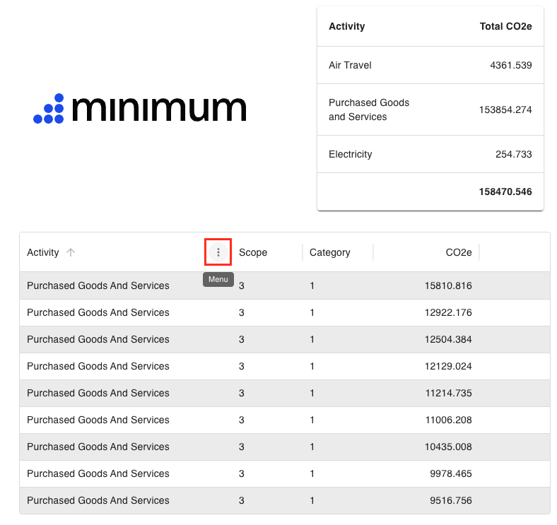
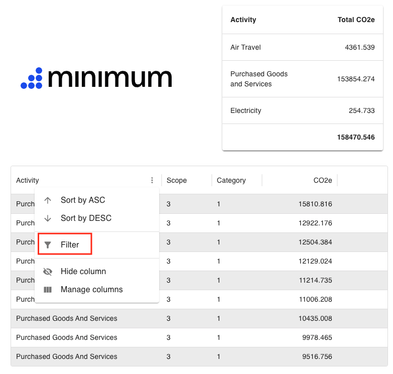
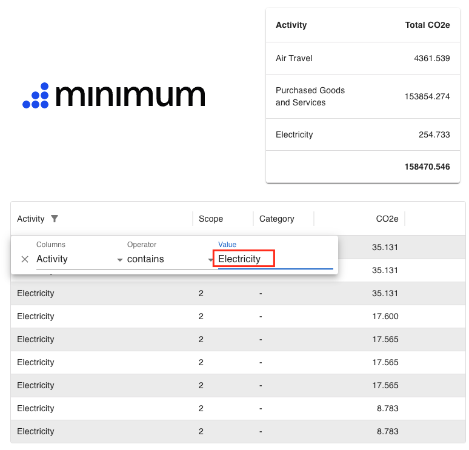

# Contacts Hub UI
User interface using the React framework displaying emissions data for various activities.
The UI consists of 2 main components:
- Emissions table
- Emission total table

## Deploying UI locally

Requirements:
- Node.js v22.4.1+

To download Node.js instructions can be found [here](https://nodejs.org/en/download)

```bash
npm install

npm run build

npm start
```

## Deploying UI via Docker Image

```bash
docker build . -t emission-frontend

docker run -p 3000:80 emission-frontend:latest
```

## Interacting with Emission Data

### Sorting data by column

To sort on a specific column, hover next to the column name, and click the arrow



### Filtering data

To filter on a specific field, click the menu on the right of the column



Select `filter`



Select the column you would like to filter, and type the filter value


